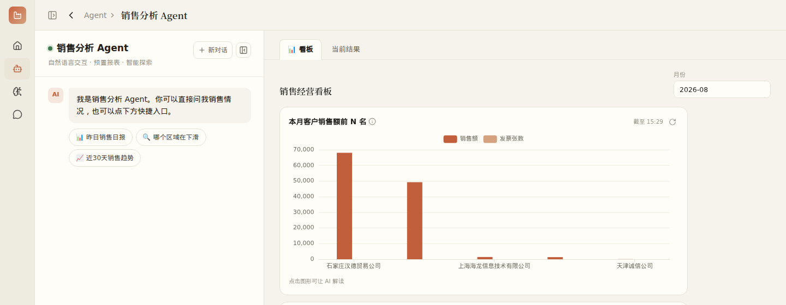
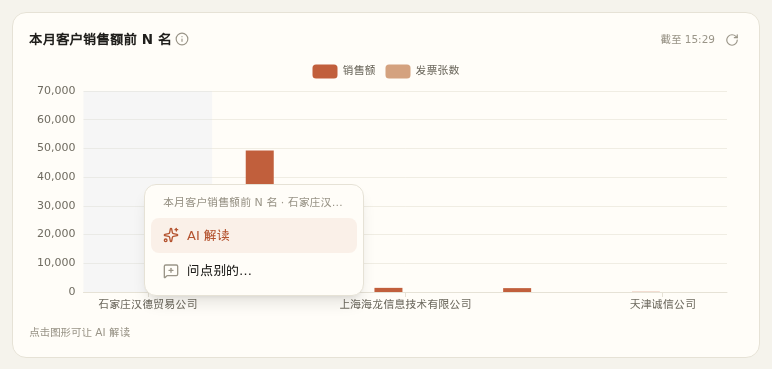

<!-- tags: 看板,bi,图表,下钻,ai解读,筛选,全屏,投屏,数据分析 -->
# BI 看板使用说明

BI 看板挂在 Agent 上：进入关联了看板的 Agent，就能看到一组固定样式的指标卡片和图表。数据秒开，有疑问可以就地下钻，或者点一下让 AI 解读。

## 打开看板

1. PC 点左侧 **「Agent」**，手机点底部中间的 **「Agent」**。
2. 选择带看板的 Agent（如「销售分析」）进入。
3. **PC**：左边是对话，右边是 **「📊 看板 / 当前结果」** 两个页签，AI 回答后右边自动切到「当前结果」，点「📊 看板」切回。
4. **手机**：顶部有 **「看板 / 对话」** 两个页签。点了「AI 解读」或提问后会自动切到「对话」。

看不到某些卡片时，页面底部会提示「另有 N 张卡片因权限未显示」，需要找管理员开通权限。

## 全屏显示

看板右上角筛选条旁有一个淡色的 **全屏图标**（四角向外的箭头，鼠标停留会提示「全屏显示看板」）：点一下看板铺满整个屏幕（隐藏左侧菜单、对话栏和顶栏，电脑浏览器还会进入浏览器全屏），适合投屏或开会时看。

- 退出：再点右上角的图标（四角向内的箭头），或按键盘 **Esc**。
- 全屏时照样可以改筛选、下钻、点击图表；点「AI 解读」或「问点别的…」会自动退出全屏，回到对话看回答。
- 筛选、下钻位置在进出全屏时都会保留。

## 筛选

看板右上角的筛选条（如「期间」「年份」）对整块看板生效。改了以后所有卡片都会按新条件重新取数。

- 月份筛选默认是本月，年份筛选默认是今年（以管理员的配置为准）。
- 切到「当前结果」再切回看板，筛选、下钻位置和已加载的数据都会保留。

## 卡片上的信息

- 标题旁的 **i** 小图标：鼠标停留可以看到这个数的**口径**（怎么算的、含不含税等）。
- **截至 hh:mm**：数据的时间。为了秒开，看板会先用缓存数据，显示「更新中」表示后台正在刷新。
- 右上角 **↻**：跳过缓存，立刻重新查询。
- 指标卡下方的箭头：和上一期比的变化（管理员配置了对比列时才显示）。

## 点击：AI 解读 / 下钻 / 问点别的

点击 **指标卡数字**、**图表上的柱子、折线点或饼图扇区**，或**表格的一行**，会弹出操作浮层：

- **✨ AI 解读**：直接发给 AI，用快模型。卡片、你点中的数据、当前筛选和口径会自动带给 AI，不用自己描述。
- **⤵ 下钻到「xx」**：卡片配置了下一级时才有。不经过 AI，直接展开下一级明细（如「客户 → 单据」）。卡片顶部会出现路径，点「返回」或路径上的名称回到上一级。
- **问点别的…**：把点中的数据作为上下文，以 📎 胶囊的形式挂在输入框上方，你再补一句问题发送（用主模型，适合复杂追问）。点胶囊上的 × 可以去掉。

小提示：

- 柱状图、折线图不必点准图形，点在绘图区内某一列的任何位置都算点中这一项。
- 卡片底部写着「点击图形可让 AI 解读」的才能点。没配下钻的表格卡片不能点。
- 上一个问题还在分析时，再点「AI 解读」会提示稍候。
- 先「AI 解读」再追问，AI 能看到前面的解读，可以接着问「为什么」「和去年比呢」。

## 和 AI 对话问数

在对话框直接问，如「本月销售额前 10 的客户」「上月应收较前月变化」。AI 会优先用看板背后的同一套查询，所以 AI 说的数和看板上的数口径一致。看板关联的 Agent 一般会配好快捷提问，点一下就能发送。

## 每日要点推送

管理员可以给看板设置「看板每日要点」定时任务：每天按你的权限读取看板数据，AI 写 3~5 条要点推送到钉钉等 IM，消息里附看板链接，点开直接进入看板。

## 常见问题

**点了图表没反应**：确认是在 Agent 页的看板上点击（管理后台里的预览不弹浮层），并且卡片底部有「点击…可让 AI 解读」的提示。

**卡片显示「暂无数据」**：先检查筛选条件（如期间是否选到了还没有数据的月份）。条件没问题仍然没有数据的，联系管理员检查查询配置。

**数字和以前看到的不一样**：先点卡片右上角 ↻ 跳过缓存刷新，再对照标题旁 i 图标里的口径说明。

**卡片报错**：普通用户只能看到简要错误，截图发给管理员即可，管理员能看到详细原因。
