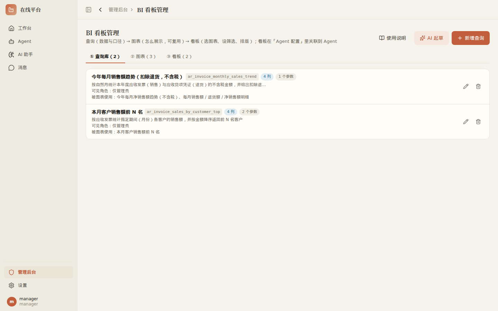
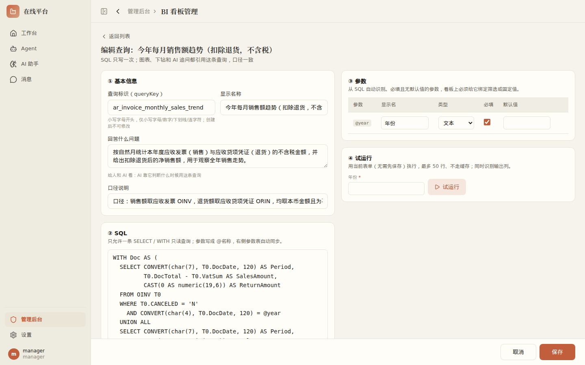
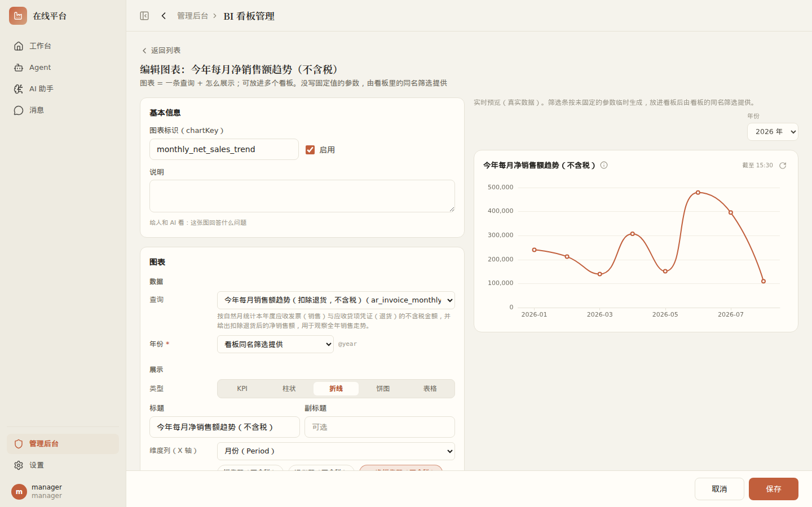
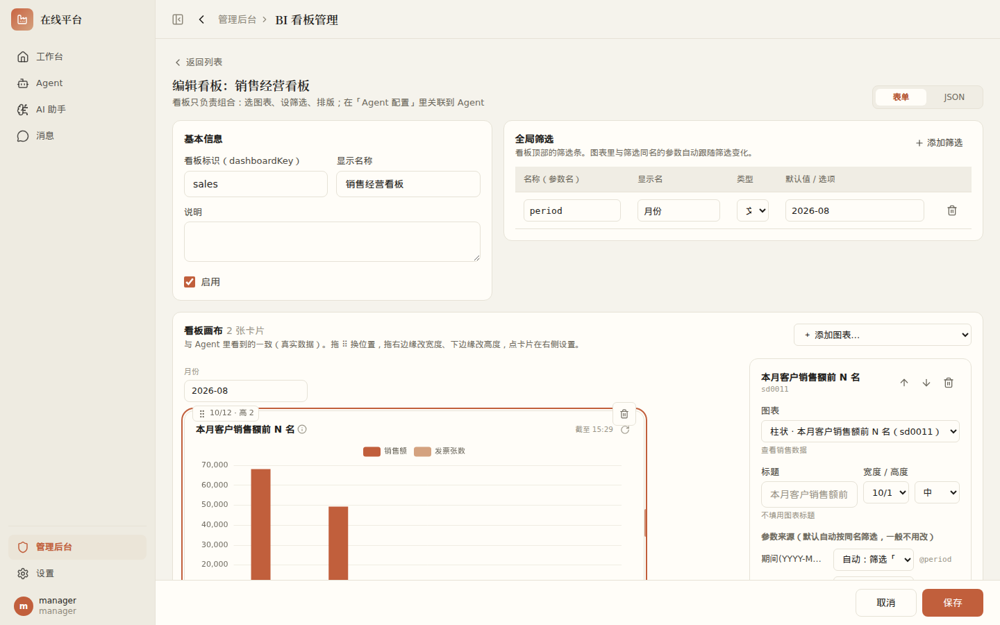

<!-- tags: 看板,bi,查询库,图表,看板配置,下钻,筛选,语义,管理员 -->
<!-- audience: admin -->
# BI 看板配置说明（管理员）

入口：**管理后台 → BI 看板管理**（仅 PC）。看板分三层维护，按顺序配置：

| 层 | 管什么 | 说明 |
|------|------|------|
| ① 查询库 | 数据与口径 | 只读 SQL、参数、输出列语义、口径、示例问法、缓存、可见角色 |
| ② 图表 | 怎么展示 | 引用一个查询 + 类型 + 列映射 + 下钻 + 默认尺寸；可被多个看板复用 |
| ③ 看板 | 组合与排版 | 全局筛选 + 选哪些图表 + 排版 |

最后到 **管理后台 → Agent 配置 → BI 看板**，把看板关联到 Agent，用户进入这个 Agent 就能看到看板。看板卡片、卡片下钻和 AI 追问都用同一份命名查询，所以看板上的数和 AI 说的数口径一致。

## 最快上手：AI 起草

「① 查询库」「② 图表」页签右上角有 **✨ AI 起草**：

1. 说一句需求，如「本月各客户销售额前 10 名」。
2. AI 读表结构写查询并试运行，SQL 报错会自己修正（最多 3 轮），再推荐 1~3 张图表。
3. 点「采用」：先在查询编辑器里核对、保存查询，再并排预览推荐的图表，勾选后一次保存。

AI 只起草，不会自动保存，一切以你确认的为准。用户 / 权限表和本系统配置表不会给 AI 看。

## ① 查询库

点「新增查询」或某条查询进入编辑，按页面上的分节填写：

1. **基本信息**：查询标识 `queryKey`（英文，创建后被图表引用，不要随意改）、名称、「回答什么问题」。
2. **SQL**：只能写单条 `SELECT` / `WITH`，参数写 `@period` 这类形式。写了 `@参数` 会自动识别到参数表。
   - SQL 下方的 **AI 修改**：一句话改口径，如「扣掉退货」「改成不含税」「加一个销售员参数」。AI 会改 SQL、同步参数和列并试运行，可撤销。
3. **参数**：类型（文本 / 数字 / 日期 / 是/否）、是否必填、默认值。默认值可以用动态值：`$thisMonth` `$lastMonth` `$today` `$yesterday` `$monthStart` `$yearStart` `$thisYear` `$lastYear`。
4. **试运行**：按参数类型生成输入框，运行后显示结果，并**自动识别输出列**。
5. **输出列**：核对每列的中文名、角色（维度 / 度量 / 时间 / 属性）、格式、单位、缩放（如 10000 = 万）。图表没写格式时就继承这里的设置，AI 也靠这些语义理解数据。
   - **AI 补全语义**：只填空着的项，已填写的不动，可撤销。
6. **示例问法**：用户可能怎么问，如「本月哪个客户买得最多」。AI 据此判断该用哪个查询。也可以在 Agent 配置里一键加为快捷提问。
7. **缓存与权限**：缓存秒数，以及可见角色（不选 = 仅管理员）。**普通用户要看到卡片，必须把他的角色加进来。**

## ② 图表

1. 选查询，再选类型：**KPI 指标卡 / 柱状 / 折线 / 饼图 / 表格**。维度、度量会按列语义自动预选。
2. 列都从查询的输出列里下拉选择。格式、单位、缩放不填就继承列语义。
3. 个别参数可以写成固定值（如 Top N = 10）。月份等参数一般**不要写死**，留给看板的同名筛选提供。
4. **下钻**：配置下一级查询（如「客户 → 单据」），参数优先从上一级点中行的同名列取值。没配下钻时，点击只用于 AI 解读。
5. 右侧 **实时预览**：用真实数据渲染，未固定的参数会临时生成筛选条。

KPI 可以配对比列（显示环比箭头）。柱状图可设横向，多个度量会画成多系列，「按系列拆分」用于长表透视。

## ③ 看板

1. **基本信息**：看板标识、名称、说明。
2. **全局筛选**：类型有月份 / 年份 / 日期 / 下拉 / 文本，默认值可用 `$thisMonth` `$thisYear` 等动态值。**筛选名和查询参数同名就会自动对上**（不区分大小写），如筛选 `period` 自动提供给所有查询的 `@period`。
3. **添加图表**：从下拉添加，按类型自动定尺寸（KPI 1/4 宽并排在最前、折线 / 表格整行、柱状 1/2、饼图 1/3）。
4. **看板画布排版**：拖 ⠿ 换位置，拖右边缘改宽度，拖下边缘改高度。画布显示的就是真实效果。
5. 点卡片，可以在右侧改标题、查看每个参数的来源，必要时覆盖。
6. 图表需要但没有来源的参数，会提示「建议建成筛选」，可以一键生成（期间 → 月份筛选、年份 → 年份筛选默认今年、日期 → 日期筛选）。
7. 高级：可以切到 JSON 模式直接编辑，与表单双向切换。

**参数从哪里来**（优先级从高到低）：下钻时上一级点中的列 → 看板卡片上的覆盖 → 图表里的固定值 → 看板同名筛选 → 查询参数默认值。必填参数没有任何来源时，保存看板会报错。

## 关联到 Agent

**管理后台 → Agent 配置**，编辑 Agent，在「BI 看板」选择看板：

- 下方显示「AI 会看到的查询目录」：可以按 Agent 的每个可见角色预览，并提示哪个角色看不到哪些卡片（查询的可见角色没覆盖到）。
- 查询的示例问法可以勾选后一键加为快捷提问，保存 Agent 后生效。
- Agent 自己的可见角色决定谁能进入，每张卡片再按查询的可见角色过滤。

## 保存时的检查

- 保存图表时检查：参数是否存在、用到的列是否在查询输出列里。
- 保存看板时检查：展开后每个必填参数都要有来源。
- 改了查询 / 图表后，如果下游对不上，仍然保存成功，但会列出受影响的图表和看板卡片，请逐个检查。
- 删除限制：查询被图表用到、图表被看板用到、看板被 Agent 关联时，都不能删除。

## 对话结果收藏到看板

在 Agent 页或 AI 助手里，AI 临时用 SQL 查出的结果下方有 **📌 收藏到看板**（仅管理员可见）。点击后会在新标签页打开 BI 看板管理，点「AI 整理成查询」，AI 会把写死的月份 / 编码改成参数，补齐名称、口径和语义，并推荐图表。之后同样是先确认查询、再确认图表。

## 预警与每日要点

- **一句话设预警**：管理后台 → 警报推送 → 一句话设预警。说一句「本月有客户销售额比上月下降超过 30%，每天 9 点提醒」，AI 从查询库选查询、写判断条件，并按当前数据试算，你补上推送对象后保存。运行时不调用 AI。触发后推送对象会在「消息 → 通知」收到一条，绑定了钉钉的同时收到钉钉消息。
- **看板每日要点**：管理后台 → 定时报告，新建任务时选「看板每日要点」并选择关联了看板的 Agent。系统按推送对象的角色读取看板数据，AI 写 3~5 条要点，附看板链接推送。表单里可以先「预览要点」。

## 常见问题

**普通用户看不到某张卡片**：检查这张卡片所用查询（以及下钻查询）的「可见角色」。Agent 配置页的查询目录预览会直接列出各角色缺哪些卡片。

**卡片没数据，但试运行有数据**：多半是参数来源不对，如年份参数被绑到了月份筛选（值是 `2026-08`）。在看板画布上点这张卡片，看右侧的参数来源。

**筛选默认值总是某个固定月份**：默认值写成了具体月份，改成 `$thisMonth`。

**改了 SQL 后用户看到的还是旧数**：保存查询时缓存会立即失效。用户那边可以点卡片右上角 ↻ 强制刷新。
